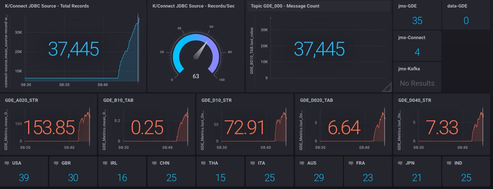

# ksql-grafana-monitoring
	loadNews - a shell script to load bundled test data from data/gdelt (102 files; 186,189 news stories)  
	config/kafka.json - a jmxtrans config file to extract nominated jmx metrics for a generic Kafka dashboard (not yet implemented)
	config/connect.json - a jmxtrans config file to extract source and sink total and per/sec metrics from Kafka Connect
	config/gde.json - a jmxtrans config file to extract producer metrics for named topics in the GDE streaming pipeline
	chronograf_GDE.json - a Chronograf dashboard (not integrated with the current release)               
	data - data subdirectories for postgres, influx and chronograf
	
	
	Instructions: Clone/download the repo docker-compose up  
	Login to Grafana using the URL below: 
	* The default username/password is admin/admin 
	* Create a Data Source for influxdb. URL=influxdb:8086, username=root, password=root, database=influxdb. 
	* Import dashboard chronograf_GDE.json. No data is visible yet.  
	
	Run the setup scripts ./runme This will execute the steps in sequence with Pauses so that you can observe.
	
	```
	It does the following: 
	 *  truncate/drop/create t​
3
This repo demonstrates monitoring a kSQL pipeline using a Grafana dashboard.
4
​
5
JMX metrics, like kittens, require an element of mustering.
6
​
7
kSQLDB and Grafana, paired with jmxtrans and Kafka offer a pipeline toolkit to capture, filter and depict JMX metrics at scale. 
8
JMXTrans sends all JVM metrics to a kafka topic where kSQLDB filters, transforms and sinks whats needed to influxdb.
9
One beneficiary of this is topic-level monitoring of streaming pipelines; where message produce metrics at the topic level can be used to determine the health of a stream processing application.
10
​
11
This topology offers other benefits:
12
* ship all JMX metrics into a kafka topic using jmxtrans wildcards; for all classes, objects and topic names.
13
* This requires regular jmxtrans container restarts to pick up new topics
14
* Use the native jmxtrans Kafka producer to stream JSON messages for wildcarded metric definitions, for each JVM server
15
* Create filter streams using kSQLDB to reduce the message pipelines to logical units: such as metrics for a stream processing applications. Largely using CASE and SUBSTR() predicates
16
* Use a kSQLDB Sink Connector to stream kSQLDB metric streams to influxDB measurements, and onwards to Grafana
17
* See "runme" for the complete pipeline; including "GDE" - a news-story processing streaming application.
18
​
19

20
​
21
​
22
```
23
It consists of:
24
docker-compose.yml - docker compose yaml for all containers
25
             runme - a shell script to initialize all objects, load data and create the streaming pipeline
26
           getNews - a shell script to pull more test data from data.gdeltproject.org
27
          loadNews - a shell script to load bundled test data from data/gdelt (102 files; 186,189 news stories)
28
 config/kafka.json - a jmxtrans config file to extract nominated jmx metrics and push to a kafka topic JMX
29
      ksqlapp.json - a grafana dashboard (not integrated with the current release)
30
              data - data subdirectories for postgres, influx and grafana
31
​
32
​
33
Instructions:
34
Clone/download the repo
35
docker-compose up
36
​
37
Login to Grafana using the URL below:
38
* The default username/password is admin/admin
39
* Create a Data Source for influxdb. URL=influxdb:8086, username=root, password=root, database=influxdb.
40
* Import dashboard ksqlapp.json. No data is visible yet.
41
​
42
Run the setup scripts
43
./runme This will execute the steps in sequence with Pauses so that you can observe
44
It does the following:
45
*  truncate/drop/create the gdelt_event table in postgres
46
* load 20190712181500.export.csv - 2203 rows into postgres table gdelt_event
47
* in kSQLDB - create JDBC Source connector sourcepostgres_<TS>
48
* CREATE STREAM GDE_010_A_STR_V01 WITH (kafka_topic='GDE_000_A_<ts>-gdelt_event', value_format='avro',partitions=1);
49
* CREATE TABLE  GDE_020_B_TAB_V01 AS SELECT ACTOR1COUNTRYCODE as CTRY, cast(count(*) as bigint) as C_COUNT ....
50
* CREATE STREAM GDE_030_C_RKY_V01 WITH (KAFKA_TOPIC='GDE_020_B_TAB_V01', VALUE_FORMAT='AVRO');
51
* CREATE STREAM GDE_040_C_RKY_V01 AS SELECT CTRY,C_COUNT,C_AVGTONE,C_MAXTONE,C_MINTONE,LAST_EVENTID FROM GDE_030_C_RKY_V01;
52
* CREATE STREAM GDE_050_C_RKY_V01 AS SELECT * FROM GDE_040_C_RKY_V01 PARTITION BY LAST_EVENTID;
53
* CREATE STREAM GDE_060_D_STR_V01 AS SELECT EVENTID as EVENTID, MONTHYEAR , YEAR , FRACTIONDATE , ACTOR1CODE , ACTOR1NAME ...
54
​
55
​
56
​
57
​
58
​
59
​
60
URLs:
61
Confluent Control Center: http://localhost:9021
62
                 Grafana: http://localhost:3000
63
he gdelt_event table in postgres 
	 * load 20190712181500.export.csv - 2203 rows into postgres table gdelt_event 
	 * in kSQLDB - create JDBC Source connector sourcepostgres_<TS> 
	 * CREATE STREAM GDE_010_A_STR_V01 WITH (kafka_topic='GDE_000_A_<ts>-gdelt_event', value_format='avro',partitions=1); 
	 * CREATE TABLE  GDE_020_B_TAB_V01 AS SELECT ACTOR1COUNTRYCODE as CTRY, cast(count(*) as bigint) as C_COUNT .... 
	 * CREATE STREAM GDE_030_C_RKY_V01 WITH (KAFKA_TOPIC='GDE_020_B_TAB_V01', VALUE_FORMAT='AVRO'); 
	 * CREATE STREAM GDE_040_C_RKY_V01 AS SELECT CTRY,C_COUNT,C_AVGTONE,C_MAXTONE,C_MINTONE,LAST_EVENTID FROM GDE_030_C_RKY_V01; 
	 * CREATE STREAM GDE_050_C_RKY_V01 AS SELECT * FROM GDE_040_C_RKY_V01 PARTITION BY LAST_EVENTID; 
	 * CREATE STREAM GDE_060_D_STR_V01 AS SELECT EVENTID as EVENTID, MONTHYEAR , YEAR , FRACTIONDATE , ACTOR1CODE , ACTOR1NAME ...       URLs: 
	
	Confluent Control Center: http://localhost:9021                  Chronograf: http://localhost:8888  
```      
			
 


