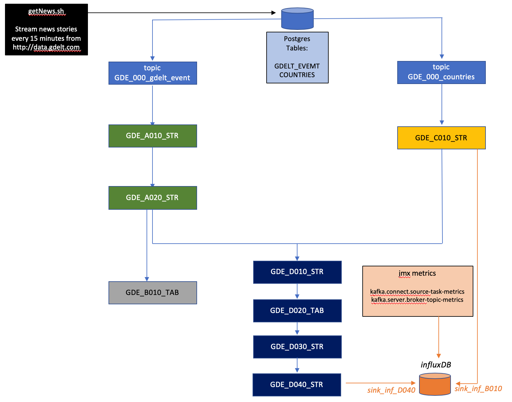

This repo demonstrates monitoring a kSQL pipeline using a Chronograf dashboard.
JMX metrics, like kittens, require an element of mustering.

kSQLDB and Chronograf, paired with jmxtrans and Kafka offer a pipeline toolkit to capture, filter and depict JMX metrics at scale. 
JMXTrans sends all JVM metrics to an influxDB database. A Kafka broker has ~150 built in metrics; which can quite easily exceed the data throughput of messages for smaller kafka clusters. So with whiteisting and filtering for nominated JMX metrics types, JMX pipelines can be built to feed a dashboard with a specific, defined role.

One possible use of a filtered JMX dashboard is topic-level monitoring of streaming pipelines; where message produce metrics at the topic level can be used to determine the health of a stream processing application.

This demo uses a public dataset GDELT. The data endpoint publishes a CSV file every fifteen minutes with one CSV line for a news story that was published online, during the last 15 minutes. The file does not contain the news story itsef; rather it contains metadata about the new story: such as the URL, various categorizations (type, country, etc), lat/long of the principal actors, an AI estimation of the tone of the story, among others. In total each line contains a total of 61 attributes for each story. There are typically 3000-10000 stories records every fifteen minutes; millions per day; and billions downloadable as CSVs online.




```
It consists of:
   docker-compose.yml - docker compose yaml for all containers
                runme - a shell script to initialize all objects, load data and create the streaming pipeline
              getNews - a shell script to pull more test data from data.gdeltproject.org
  config/connect.json - a jmxtrans config file to extract nominated jmx metrics from Kafka Connect
      config/gde.json - a jmxtrans config file to extract topic producer metrics from nominated topics in teh streaming app
    config/kafka.json - a jmxtrans config file to extract nominated jmx metrics from Kafka brokers (not used yet)
 config/countries.sql - an init file used to populate a countries table in postgres
         ksqlapp.json - a Chronograf dashboard (not integrated with the current release)
                 data - persistent data subdirectories for postgres, influx and Chronograf
Instructions:
Clone/download the repo
docker-compose up
Login to Chronograf using the URL below:
* The default username/password is admin/admin
* Create a Data Source for influxdb. URL=influxdb:8086, username=root, password=root, database=influxdb.
* Import dashboard ksqlapp.json. No data is visible yet.
```


To run the demo:
1. Clone or download the repo, unpack and cd to the directory. Start the docker daemon with 8GB RAM.
Add this line to your /etc/hosts:
```
127.0.0.1 localhost ksqldb-server kafka1
```

Set the docker-comose project name
```
export COMPOSE_PROJECT_NAME=ksqdb-jmx-monitoring-master
```

2. Stand up the docker-compose. This takes approx ten minutes to pull and start all images.
```
docker-compose -p ksqdb-jmx-monitoring-master up
```

3. In a second terminal window, verify that all containers are in status "up"
If not, then run docker-compose start <containerName> to restart any stopped containers
```
$ docker-compose -p ksqdb-jmx-monitoring-master ps
      Name                    Command                  State                           Ports                     
-----------------------------------------------------------------------------------------------------------------
Postgres           docker-entrypoint.sh postgres    Up             5432/tcp                                      
chronograf         /entrypoint.sh chronograf        Up             0.0.0.0:8888->8888/tcp                        
control-center     /etc/confluent/docker/run        Up             0.0.0.0:9021->9021/tcp                        
influxdb           /entrypoint.sh influxd           Up             8083/tcp, 0.0.0.0:8086->8086/tcp              
jmx-connect        /docker-entrypoint.sh star ...   Up             9999/tcp                                      
jmx-gde            /docker-entrypoint.sh star ...   Up             9999/tcp                                      
jmx-kafka          /docker-entrypoint.sh star ...   Up             9999/tcp                                      
kafka-connect-01   bash -c echo "Installing C ...   Up (healthy)   0.0.0.0:8083->8083/tcp, 9092/tcp              
kafka1             /etc/confluent/docker/run        Up             0.0.0.0:3001->3001/tcp, 0.0.0.0:9092->9092/tcp
ksqldb-cli         /bin/sh                          Up                                                           
ksqldb-gde         /usr/bin/docker/run              Up             0.0.0.0:8088->8088/tcp                        
schema-registry    /etc/confluent/docker/run        Up             0.0.0.0:8081->8081/tcp                        
zookeeper          /etc/confluent/docker/run        Up             2181/tcp, 2888/tcp, 3888/tcp                  	
```

4. Open http://localhost:9021 to verify that Confluent Control Center is running. 


```
Check these:
a. on the Launch page, check verify: "Healthy Clusters"=1, "KSQL CLusters"=1 and "Connect Clusters"=1
b. Under CO Cluster 1 | Topics, check for a total of four topics; for Kafka Connect and kSQL processing
c. Under KSQL check that "Running Queries"=0 and "Registered Streams"=1
d. Under Connect | Cluster Name="cdc" each of the four columns should show a value of 0

If you see different values, then some containers may not have started (so start them manually)
Or, if you are reusing containers, then see the steps to initialize containers below.
```

5. Open http://localhost:8888 to check if Chronograf is running.

6. The containers are initialized and ready. The "runme" script executes all steps to build objects for the demo.

Run runme with "--interactive" to run the demo interactively. Wait at least five seconds between pressing <return> to ensure that kSQLDB streams and tables have been created before running the next step.
```
./runme --interactive
```

To run it without any prompts, just run it without any argument:
```
./runme
```


./runme This will execute the steps in sequence with Pauses so that you can observe
It does the following:
* truncate/drop/create the gdelt_event table in postgres
* load 20190712181500.export.csv - 2203 rows into postgres table gdelt_event
* in kSQLDB - create JDBC Source connector sourcepostgres_<TS>
* CREATE SOURCE CONNECTOR source_jdbc_gdelt_event WITH ...
* CREATE SOURCE CONNECTOR source_jdbc_countries WITH ...
* CREATE STREAM GDE_A010_STR WITH (kafka_topic='GDE_000_gdelt_event', value_format='avro',partitions=1);
* CREATE TABLE GDE_B020_TAB AS SELECT cast(count(*) as bigint) as C_COUNT FROM GDE_A010_STR GROUP BY 0;
* CREATE STREAM GDE_A020_STR AS SELECT * FROM GDE_A010_STR PARTITION BY ACTOR1COUNTRYCODE;
* CREATE STREAM GDE_C010_STR AS SELECT * FROM GDE_000_COUNTRIES PARTITION BY ISO3;
* CREATE STREAM GDE_D010_STR AS SELECT EVENTID ...  FROM GDE_A020_STR JOIN GDE_C010_STR WITHIN 60 MINUTES ON (ACTOR1COUNTRYCODE=ISO3);
* CREATE TABLE GDE_D020_TAB  AS SELECT ACTOR1_COUNTRYNAME as CTRY, cast(count(*) as bigint) as C_COUNT ... FROM GDE_D010_STR GROUP BY ACTOR1_COUNTRYNAME;
* CREATE STREAM GDE_D030_STR AS SELECT replace(replace(replace(replace(' {"schema":{"type":"struct","fields":[{" ...  as influx_json_row FROM GDE_D020_TAB
* CREATE SINK CONNECTOR sinkinflux_gde_${DT2} ...

URLs:
Confluent Control Center: http://localhost:9021
                 Chronograf: http://localhost:8888
```      
			
 


